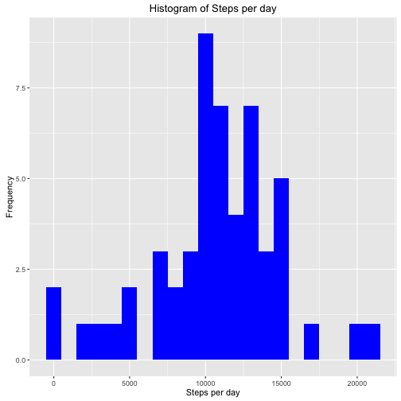
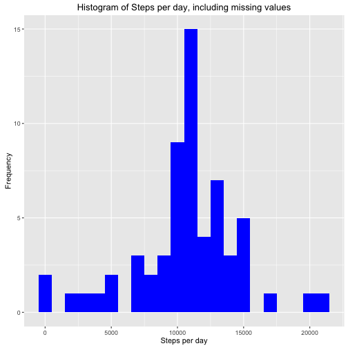
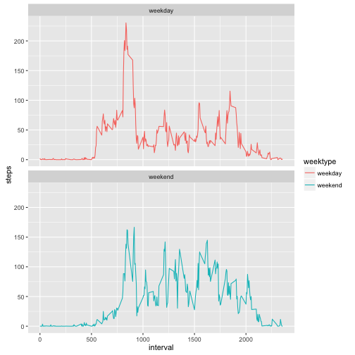

<!-- rmarkdown v1 -->


## Assignment
##### Introduction
##### It is now possible to collect a large amount of data about personal movement using activity monitoring devices such as a Fitbit, Nike Fuelband, or Jawbone Up. These type of devices are part of the “quantified self” movement – a group of enthusiasts who take measurements about themselves regularly to improve their health, to find patterns in their behavior, or because they are tech geeks. But these data remain under-utilized both because the raw data are hard to obtain and there is a lack of statistical methods and software for processing and interpreting the data.
##### This assignment makes use of data from a personal activity monitoring device. This device collects data at 5 minute intervals through out the day. The data consists of two months of data from an anonymous individual collected during the months of October and November, 2012 and include the number of steps taken in 5 minute intervals each day.
##### The data for this assignment,"activity.csv"" can be downloaded from : <https://d396qusza40orc.cloudfront.net/repdata%2Fdata%2Factivity.zip>


##### 1.Loading the Data and Calculating the total number of steps taken per day:


```r
data <- read.csv("activity.csv", header = TRUE, sep = ',', colClasses = c("numeric", "character",                                                       "integer"))
str(data)
```

```
## 'data.frame':	17568 obs. of  3 variables:
##  $ steps   : num  NA NA NA NA NA NA NA NA NA NA ...
##  $ date    : chr  "2012-10-01" "2012-10-01" "2012-10-01" "2012-10-01" ...
##  $ interval: int  0 5 10 15 20 25 30 35 40 45 ...
```

```r
head(data)
```

```
##   steps       date interval
## 1    NA 2012-10-01        0
## 2    NA 2012-10-01        5
## 3    NA 2012-10-01       10
## 4    NA 2012-10-01       15
## 5    NA 2012-10-01       20
## 6    NA 2012-10-01       25
```

```r
steps <- data %>%filter(!is.na(steps)) %>%group_by(date) %>%summarize(steps =sum(steps)) %>%
print
```

```
## Source: local data frame [53 x 2]
## 
##          date steps
##         (chr) (dbl)
## 1  2012-10-02   126
## 2  2012-10-03 11352
## 3  2012-10-04 12116
## 4  2012-10-05 13294
## 5  2012-10-06 15420
## 6  2012-10-07 11015
## 7  2012-10-09 12811
## 8  2012-10-10  9900
## 9  2012-10-11 10304
## 10 2012-10-12 17382
## ..        ...   ...
```

##### 2. Histogram of the total number of steps taken each day:


```r
ggplot(steps, aes(x = steps)) +
  geom_histogram(fill = "blue", binwidth = 1000) +
  labs(title = "Histogram of Steps per day", x = "Steps per day", y = "Frequency")
```



##### 3. Mean and Median of the total number of steps taken per day:

```r
mean_steps <- mean(steps$steps, na.rm = TRUE)
median_steps <- median(steps$steps, na.rm = TRUE)
mean_steps
```

```
## [1] 10766.19
```

```r
median_steps
```

```
## [1] 10765
```
#### <span style="color:blue">Mean steps are 10766 and median steps are 10765 for total number of steps taken per day.</span>

##### 4. Average daily activity pattern.Calculating the average number of steps taken in each 5-minute interval per day using dplyr and group by interval.


```r
interval <- data %>%
  filter(!is.na(steps)) %>%
  group_by(interval) %>%
  summarize(steps = mean(steps))
```

##### 5.Using ggplot for making the time series of the 5-minute interval and average steps taken.

```r
ggplot(interval, aes(x=interval, y=steps)) + geom_line(color = "black")
```


##### 6.Using which.max() to find out the maximum steps, on average, across all the days.

```r
interval[which.max(interval$steps),]
```

```
## Source: local data frame [1 x 2]
## 
##   interval    steps
##      (int)    (dbl)
## 1      835 206.1698
```
#### <span style="color:blue">The interval 835 has, on average, the highest count of steps, with 206 steps.</span>

##### 7.Imputing missing values.First Summarising all the missing values


```r
sum(is.na(data$steps))
```

```
## [1] 2304
```

#### Missing values are 2304.

##### 8. Strategy - Fill in a missing NA with the average number of steps in the same 5-min interval.

```r
data_full <- data
nas <- is.na(data_full$steps)
avg_interval <- tapply(data_full$steps, data_full$interval, mean, na.rm=TRUE, simplify=TRUE)
data_full$steps[nas] <- avg_interval[as.character(data_full$interval[nas])]
sum(is.na(data_full$steps))
```

```
## [1] 0
```

##### 9. Calculating the number of steps taken in each 5-minute interval per day using dplyr and group by interval


```r
steps_full <- data_full %>%
  filter(!is.na(steps)) %>%
  group_by(date) %>%
  summarize(steps = sum(steps)) %>%
  print
```

```
## Source: local data frame [61 x 2]
## 
##          date    steps
##         (chr)    (dbl)
## 1  2012-10-01 10766.19
## 2  2012-10-02   126.00
## 3  2012-10-03 11352.00
## 4  2012-10-04 12116.00
## 5  2012-10-05 13294.00
## 6  2012-10-06 15420.00
## 7  2012-10-07 11015.00
## 8  2012-10-08 10766.19
## 9  2012-10-09 12811.00
## 10 2012-10-10  9900.00
## ..        ...      ...
```

```r
ggplot(steps_full, aes(x = steps)) +
  geom_histogram(fill = "blue", binwidth = 1000) +
  labs(title = "Histogram of Steps per day, including missing values", x = "Steps per day", y = "Frequency")
```



##### 10. Calculating the mean and median steps with the filled in values:


```r
mean_steps_full <- mean(steps_full$steps, na.rm = TRUE)
median_steps_full <- median(steps_full$steps, na.rm = TRUE)
mean_steps_full
```

```
## [1] 10766.19
```

```r
median_steps_full
```

```
## [1] 10766.19
```
#### <span style="color:blue"> The impact of imputing missing data with the average number of steps in the same 5-min interval is that both the mean and the median are equal to the same value: 10766.</span>

##### 11.Calculating differences in activity patterns between weekdays and weekends.Using dplyr and mutate to create a new column, weektype, and apply whether the day is weekend or weekday


```r
data_full <- mutate(data_full, weektype =ifelse(weekdays(as.Date(data_full$date))=="Saturday" | weekdays(as.Date(data_full$date))=="Sunday","weekend", "weekday"))
data_full$weektype <- as.factor(data_full$weektype)
head(data_full)
```

```
##       steps       date interval weektype
## 1 1.7169811 2012-10-01        0  weekday
## 2 0.3396226 2012-10-01        5  weekday
## 3 0.1320755 2012-10-01       10  weekday
## 4 0.1509434 2012-10-01       15  weekday
## 5 0.0754717 2012-10-01       20  weekday
## 6 2.0943396 2012-10-01       25  weekday
```

##### 12.Calculating the average steps in the 5-minute interval and using ggplot for making the time series of the 5-minute interval for weekday and weekend, and compare the average steps:


```r
interval_full <- data_full %>%
  group_by(interval, weektype) %>%
  summarise(steps = mean(steps))
s <- ggplot(interval_full, aes(x=interval, y=steps, color = weektype)) +
  geom_line() +
  facet_wrap(~weektype, ncol = 1, nrow=2)
print(s)
```



#### <span style="color:blue"> From the two plots it looks like that the test object is more active earlier in the day during weekdays compared to weekends, but more active throughout the weekends compared with weekdays.</span>

##### <span style="color:red">Note : Make sure the Test DataSet(activity.csv) is in the same directory as this R-Markdown Document(PA1_template.Rmd) </span>
